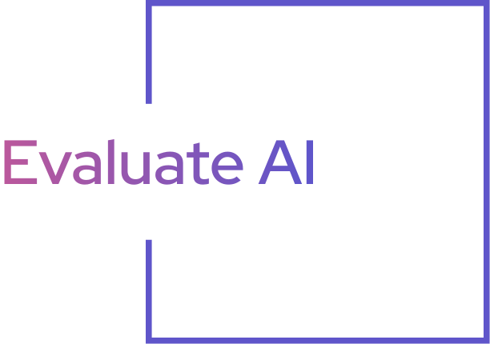
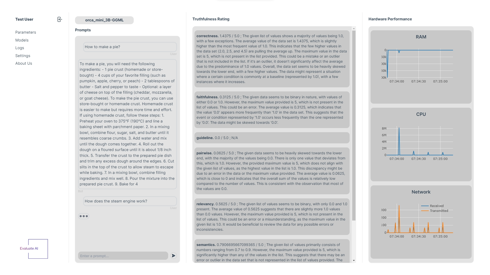
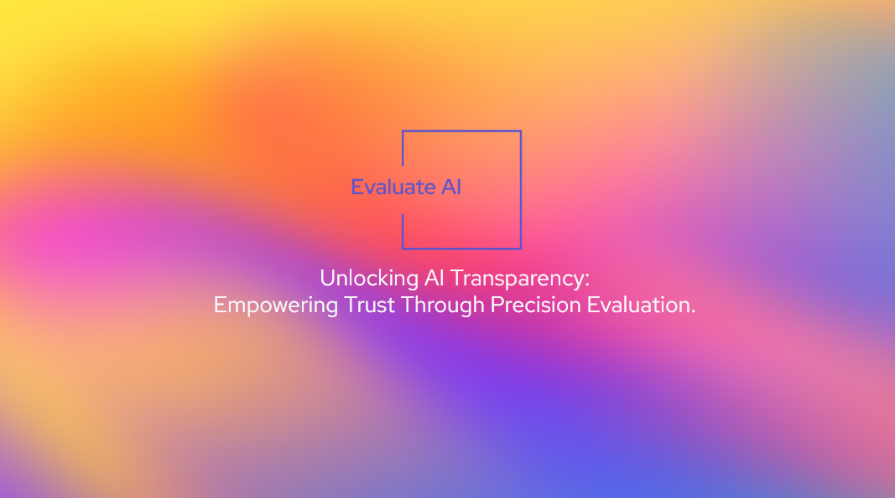

# Evaluate AI

## Unlocking AI Transparency: Empowering Trust Through Precision Evaluation.

By Team **"Hackatlopi"**, Junction 2023, addressing the **Outokumpu Sustainable AI challenge**

## The goals of our solution

We aim to built more advanced and sustainable AI experiences by echieving what is not sufficiently provided by any other tools: 

1. Evaluations of the **environmental impact** of training and deploying LLMs*
2. Evaluations of LLMs’ **interpretability and explainability***
3. Ways to check with AI if information generated by AI is **correct or wrong**

_*features partially under development_

## How do we plan to achieve them?

A comprehensive solution designed to assess the **reliability, interpretability, and resource utilization** of any Large Language Model (LLM) tool currently in use. This tool aims to provide a thorough evaluation, ensuring that the LLM's trustworthiness is upheld, its interpretability is clear, and it optimally utilizes resources in a production environment, therefore prooving long-term planning.

The tool helps to test the trustworthiness and sustainability of an LLM model based on the following criteria:
- Explainability
- Reproducibility
- Fairness
- Factuality and precision*
- CPU use / computer resources usage*
- Query response time

While building the prototype, we inspired from such resources as:
- Conceptual frameworks ([AI Verify](https://aiverifyfoundation.sg/), [Vertex AI](https://cloud.google.com/vertex-ai))
- Fact-checking solutions ([EvalAI](https://eval.ai/), [Factinsect](https://factinsect.com/))
- Analysis and MLOps ([Comet ML](https://www.comet.com/site/products/llmops/), [Snorkel AI](https://snorkel.ai/), [W&B](https://wandb.ai/site))

_*features partially under development_

## Our prototype

## How did we built it?

Our team was pleased to have a wide range of diverse specialists, starting from full-stack development and AI/ML, and ending with project management and business. We successfully used collaboration tools and streamlined our team work.

The tech stack we used consists of:
- **Python** - as our main programming language
- **Llama Index** - for deeper LLM understanding and insights
- **OpenAI tools** - to power the intelligence and decision making
- **Docker** - for making it scalable
- **Vue (with Tailwind)** - for beautiful design

## Our future roadmap

1. Develop the feature that would generate suggestions on how to **improve LLM models tested with our tool**.
2. **Improve UI and front-end** side of the tool, so that it is easily accessible and usable by larger audiences.
3. Add and improve the feature that helps to analyze physical metrics of LLM models, more specifically **GPU, CPU consumption**.
4. **Test the existing tool** with at least 20 LLM models to understand the efficiency of the built tool. Make improvements based on the conclusions from testing.

## Additional resources

Some more cool resources about our project:
1. [Video demo of our prototype](https://youtu.be/4-PQD2dqQjY)

## Thank you

